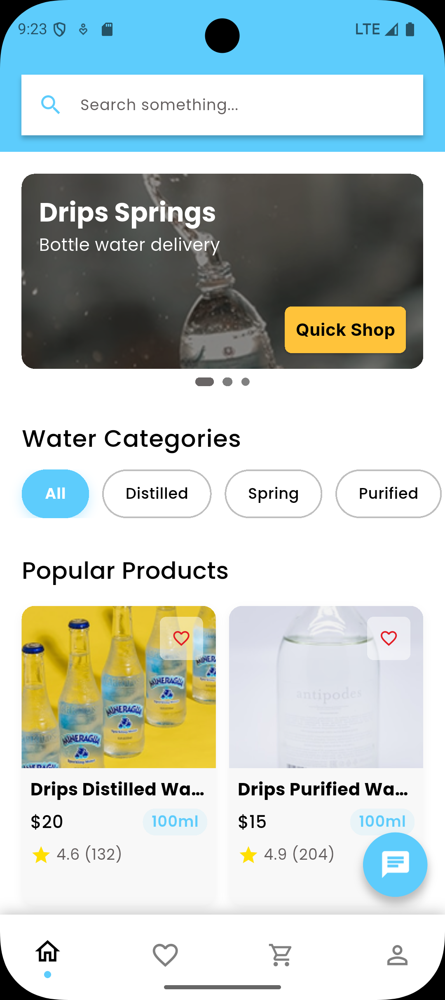
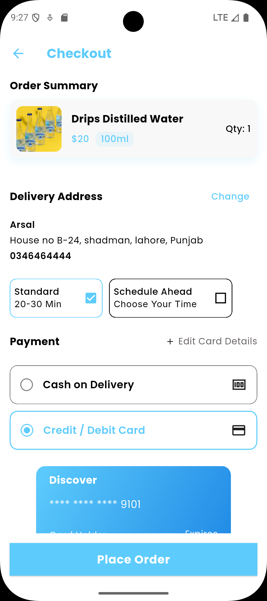
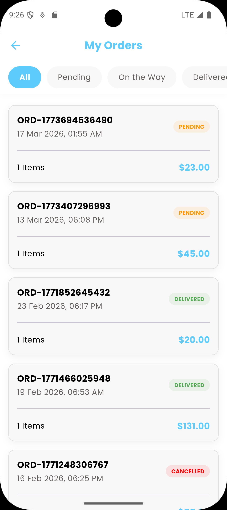
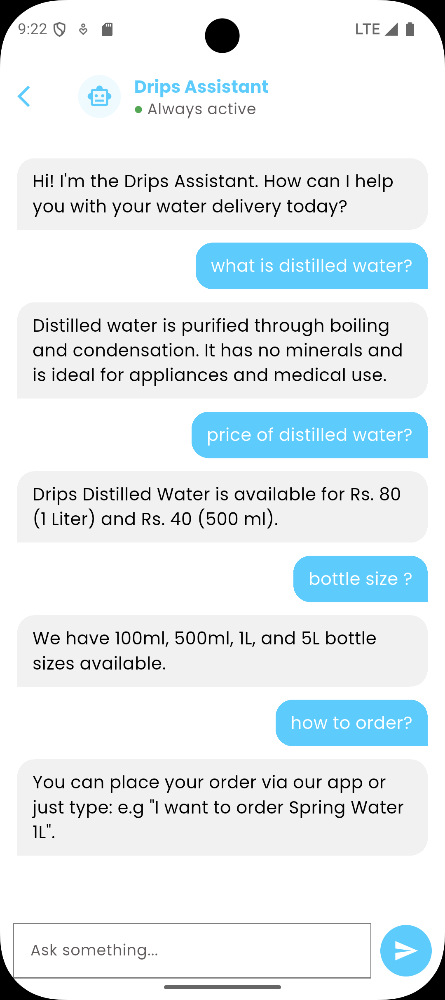
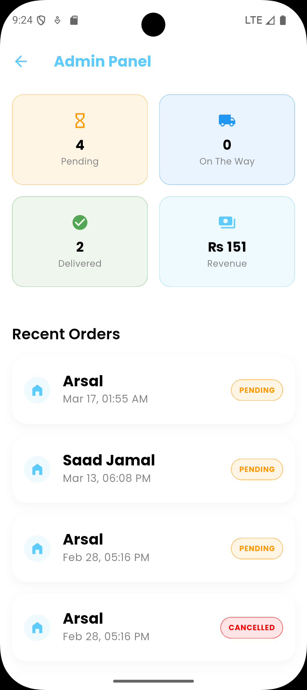

# 💧 Drips Water

**The Future of Hydration**

Drips Water is a high-performance, cross-platform mobile and web solution built with Flutter and Firebase. It streamlines the water delivery lifecycle—from AI-powered customer support to real-time admin fulfillment—ensuring that clean water is always just a tap away.

---

## 📸 App Preview

| Customer UI | AI Chatbot | Admin Dashboard |
| :---: | :---: | :---: |
|    |  |  |

---

## 🚀 Key Features

### 📱 Customer Experience
* **Seamless Onboarding:** Elegant Splash and Onboarding flows with Guest mode support.
* **AI-Powered Support:** Integrated **Google DialogFlow Chatbot** for 24/7 instant customer inquiries.
* **Dynamic Marketplace:** Home screen featuring product sliders, category filtering, and high-speed search.
* **Address Management:** Multiple location support (Home, Office, Other) with "Smart Labels" and default settings.
* **Advanced Checkout:**
  * Custom delivery scheduling (User-selected date & time).
  * Promo code engine & multi-payment support (COD/Saved Cards).
* **Post-Purchase Logic:**
  * Real-time Order Tracking and Order History with status filtering.
  * One-tap **Re-order** and **Cancel Order** functionality.

### 🛡️ Admin Control Center (The "Secret Room")
* **Role-Based Access:** Secure dashboard accessible only to accounts with `admin` privileges.
* **Live Order Feed:** Real-time stream of all incoming orders platform-wide using Firestore Snapshots.
* **Bento Stats Engine:** Live visualization of Revenue, Pending Dispatches, and Logistics.
* **Fulfillment Logic:** Full CRUD capabilities for orders, including status progression (Dispatch -> Deliver).

---

## 🏗️ Technical Architecture

The project follows a strict **Clean Architecture** pattern to ensure scalability and maintainability:

1. **Repository Layer (Data):** Isolated Firebase/Firestore infrastructure for direct data communication.
2. **Service Layer (Bridge):** Logic bridge for processing payments, promos, and AI (DialogFlow) queries.
3. **Provider Layer (State):** Manages reactive UI state using the `provider` package.
4. **Presentation Layer (UI):** High-quality, responsive widgets using a custom "Bento" design system.

---

## 🛠️ Tech Stack

* **Frontend:** Flutter 3.x+ (Mobile & Web)
* **Backend:** Firebase (Auth, Firestore, Hosting, Analytics)
* **AI:** Google DialogFlow
* **State Management:** Provider
* **Security:** Granular Firestore Security Rules (RBAC)

---

## 🚦 Installation & Setup

### Prerequisites
* Flutter SDK (v3.19.0 or higher)
* A Firebase Project configured

### Setup Steps

1. **Clone the repository**
   ```bash
   git clone [https://github.com/yourusername/drips_water.git](https://github.com/yourusername/drips_water.git)
   cd drips_water

   ```

2. **Install dependencies**

   ```bash
   flutter pub get
   ```

3. **Configure Firebase**
   - Run `flutterfire configure` or manually add `google-services.json` (Android) and `GoogleService-Info.plist` (iOS).

4. **Run the app**
   ```bash
   flutter run
   ```

---

## 🔐 Security & Roles

To enable Admin features for a specific user:

1.  Navigate to the **Firestore Console**.
2.  Locate the user's document in the `users` collection.
3.  Add a field `role: "admin"` (String).
4.  The "Admin Panel" button will automatically appear in that user's profile.

---

## 📝 License

Distributed under the MIT License. See `LICENSE` for more information.

---

\*\*Developed with ❤️ by Muhammad Saad Jamal
